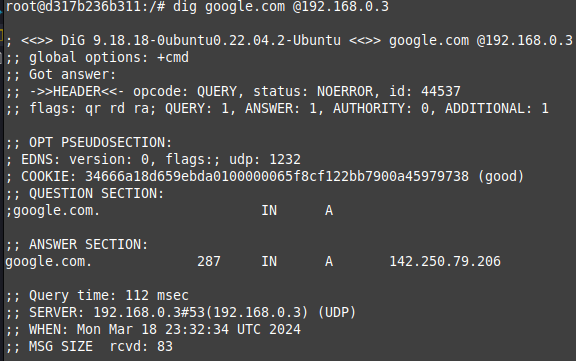

## Atividade 01 - 2024/01 - Exercício de Configuração de Rede em Docker

Você foi designado para configurar um ambiente de rede em Docker para uma empresa fictícia. Este ambiente deve incluir serviços essenciais de rede, como DHCP, DNS e Firewall, para garantir conectividade e segurança adequadas. Você deve configurar cada serviço em um container Docker separado e garantir que eles se comuniquem adequadamente entre si. Além disso, é necessário criar Dockerfiles para cada imagem necessária, com base na imagem ubuntu:latest, e realizar testes para validar a configuração da rede.

## Estrutura do Projeto

- dockerfile.dhcp
- dockerfile.dns
- dockerfile.firewall
- dhcpd.conf (arquivo de configuração necessário para DHCP)
- firewall_rules.sh (arquivo de configuração necessário para FIREWALL)
- named.conf.options (arquivo de configuração necessário para DNS)
- README.md

## Pré-requisitos

- Considerar sistema de criação (HOST) Linux Mint 21.3
- Docker 24.0.5

## Rede

- A rede foi configurada com o nome "rede" e o endereço "192.168.1.0/24", com o comando "sudo docker network create --subnet=192.168.1.0/24 rede".

- Então para se deve usar o "--net rede" para cada container, para que eles possam se comunicar entre si, na mesma rede. Como mostrado acima, na aba de instrução de uso.

## Instruções de Uso

1. Clone o repositório do Github.
2. Acesse-o pelo terminal a pasta onde o projeto foi clonado.
3. Execute o comando "sudo docker build -t orlandofilho04/dhcp:latest -f dockerfile.dhcp ." para iniciar a criação do container DHCP.
4. Execute o comando "sudo docker build -t orlandofilho04/dns:latest -f dockerfile.dns ." para iniciar a criação do container DNS.
5. Execute o comando "sudo docker build -t orlandofilho04/firewall:latest -f dockerfile.firewall ." para iniciar a criação do container FIREWALL.
6. Após a criação do container DHCP, digite "sudo docker run -d --net rede --name dhcp orlandofilho04/dhcp" para iniciar a execução do container DHCP.
7. Após a criação do container DNS, digite "sudo docker run -d --net rede --name dns orlandofilho04/dns" para iniciar a execução do container DNS.
8. Após a criação do container FIREWALL, digite "sudo docker run -d --name firewall --restart always --net rede --privileged orlandofilho04/firewall" para iniciar a execução do container FIREWALL.
9. Se necessário adentrar no container em execução use "sudo docker exec -it (dhcp/dns/firewall) /bin/bash", apenas usando um das três opções dos nomes atribuidos em cada um dos containers.
10. Se necessário parar a execução do container "sudo docker stop (dhcp/dns/firewall)", apenas usando um das três opções dos nomes atribuidos em cada um dos containers.

## Funcionamento

- Container DHCP. O container foi configurado com um arquivo chamado "dhcp.conf", o qual contém as configurações necessárias para o serviço DHCP. Para seu funcionamento também foi aberta a porta 67/UDP no container, permitindo que o servidor DHCP atribua endereços IP a novos dispositivos que se conectem à rede por meio dessa porta, foi separado a faixa da rede 192.168.1.100 a 192.168.1.200 para se atribuir aos demais containers.

- Container DNS. O container foi configurado com um arquivo chamado "named.conf.options", o qual contém as configurações necessárias para o serviço DNS. Para seu funcionamento também foi aberta a porta 53 TCP/UDP, afim de realizar a resolução dos nomes na rede.

- Container FIREWALL. O container foi configurado com um arquivo chamado "firewall_rules.sh", o qual contém as configurações necessárias para o serviço FIREWALL. Seu funcionamento consiste em bloquear o acesso de todas as portas e liberando somente para as portas DHCP e DNS liberadas nos containers anteriores.

## Testes

- DHCP:

  - Para testar o funcionamento do servidor DHCP, basta conectar um novo dispositivo à rede e verificar se ele recebe um endereço IP automaticamente. Isso pode ser feito por meio do comando "ip a" no terminal do dispositivo.
  - Ou, adentrar o container DHCP e verificar se os endereços estão sendo atribuídos. Com o seguinte comando "tail -f /var/log/dhcpd.log", deve retornar os endereços atribuídos.
  - E por fim a melhor maneira de se testar, conferir se o ip dos outros containers ficaram corretos. Para isso se deve entrar nos containers "dns" ou "firewall" e verificar se o ip atribuido foi colocado de forma correta e esteja dentro da faixa de ip determinada (192.168.1.100 a 192.168.1.200).
  -    Mostra o ip configurado do container DNS.
  -    Mostra o ip configurado do container FIREWALL.

- DNS:

  - Para testar o funcionamento do servidor DNS, basta tentar acessar um site por meio de seu nome, em vez de seu endereço IP. Isso pode ser feito por meio do comando "ping" no terminal do dispositivo.
  - Ou, adentrar o container DNS e verificar se os endereços estão sendo resolvidos. Com o seguinte comando "tail -f /var/log/named/named.log", deve retornar os endereços resolvidos.
  - Ou, adentrar o container DNS e verificar se os nomes estão resolvidos. Com o seguinte comando "dig www.example.com". Assim com algum site em espeiífico, deve retornar o ip relacionado a esse endereço.
  -    Mostra o site com o nome resolvido pelo DNS.

- FIREWALL:
  - Para testar o funcionamento do FIREWALL, basta tentar acessar um site por meio de seu nome, em vez de seu endereço IP. Isso pode ser feito por meio do comando "ping" no terminal do dispositivo.
  - Ou, adentrar o container FIREWALL e verificar se as portas estão bloqueadas. Com o seguinte comando "iptables -L", deve retornar as portas bloqueadas e liberadas. E o retorno deve ser apenas a visualização das das portas liberadas, ou seja, as portas do container "dns" e "dhcp", sendo elas 53 e 67:68 respectivamente.
  -    Mostra que a porta 53 está liberada no FIREWALL.
  -    Mostra quais as portas estão liberadas no FIREWALL.
